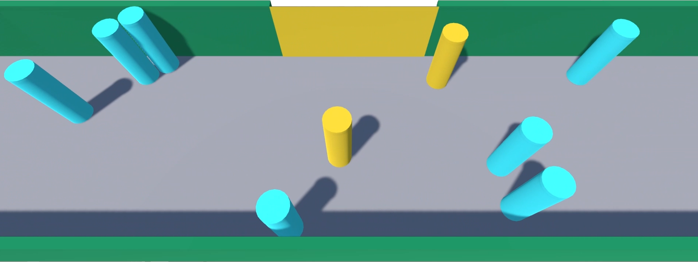
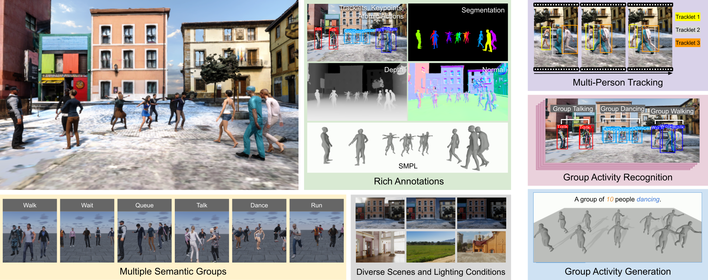

---
# https://vitepress.dev/reference/default-theme-home-page
layout: home

hero:
  name: "Danrui Li"
  text: ""
  tagline: PhD Student in Computer Science at Rutgers University, exploring the boundaries among human behavior modeling, artificial intelligence, and architectural design.
  actions:
    - theme: brand
      text: Research
      link: /research
    - theme: brand
      text: CV
      link: /cv
    - theme: alt
      text: LinkedIn
      link: https://www.linkedin.com/in/danrui-li-a4b5a5189/
    - theme: alt
      text: ResearchGate
      link: https://www.researchgate.net/profile/Danrui_Li2
---

Selected Work

  
  

  ## Microscopic modeling of attention-based movement behaviors

  
Danrui Li, Mathew Schwartz, Samuel S. Sohn, Sejong Yoon, Vladimir Pavlovic, Mubbasir Kapadia

  <smallButton text="Project page" link="https://danruili.github.io/AttentionMove/"></smallButton> <smallButton text="Read article" link="https://arxiv.org/abs/2403.14892"></smallButton>

  How will attention affect walking speed in retail areas? We model how pedestrians will be attracted to environmental objects and how this will slow down their walking speed. Then we show how our model can help optimize the design of retail areas in transportation hubs. 

  Published in Transportation Research Part C: Emerging Technologies, 2024.
  

  

      
  

  
  

  ## Learning from Synthetic Human Group Activities

  
Che-Jui Chang, Danrui Li, Deep Patel et al. (2024)

  <smallButton text="Project page" link="https://cjerry1243.github.io/M3Act/"></smallButton> <smallButton text="Read article" link="https://openaccess.thecvf.com/content/CVPR2024/papers/Chang_Learning_from_Synthetic_Human_Group_Activities_CVPR_2024_paper.pdf"></smallButton>

  A synthetic data generator for multi-view multi-group multi-person human atomic actions and group activities, which facilitates the learning of human-centered tasks across single-person, multi-person, and multi-group conditions.

  Published in CVPR 2024.
  

  

      
  

## Influence of Security Check Procedures on Transfer Efficiency from Railway Stations to Subways

Yu Zhuang, Danrui Li (2024)

<smallButton text="Read article" link="http://dx.doi.org/10.11908/j.issn.0253-374x.22209"></smallButton>

The influence of arriving passengers and the interaction effects between external factors are compared in two scenarios: the mutual recognition of security checks and the application of face recognition systems.

Published in Journal of Tongji University.
