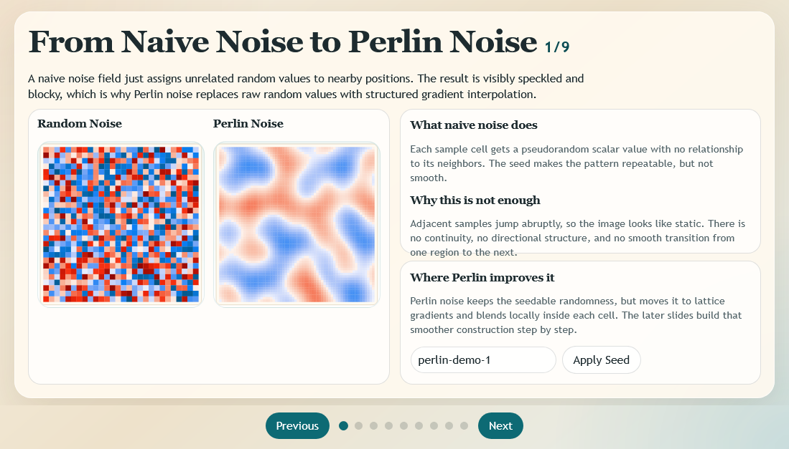
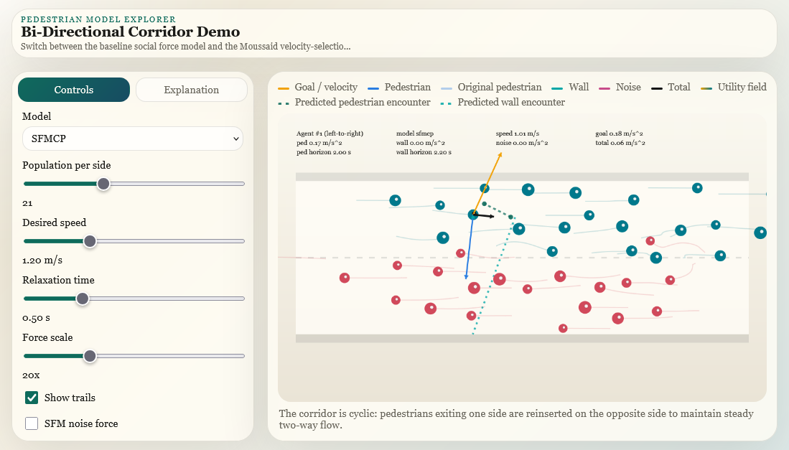

# Intro to Computer Graphics

Served as Teaching Assistant and Part-time Lecturer for 16:198:428 and 16:198:523 at Rutgers University (2026).

## Teaching Materials

### Step-wise Terrain Generation
Step-by-step visualization of Perlin Noise construction and Fractal Brownian Motion (fBM)

[Visit Interactive Demo](https://danruili.github.io/TerrainNoiseStepByStep/)

### Pedestrian Model Explorer

Explore various pedestrian models in a bi-directional corridor simulator.

[Visit Interactive Demo](https://danruili.github.io/PedestrianModelExplorer/)

